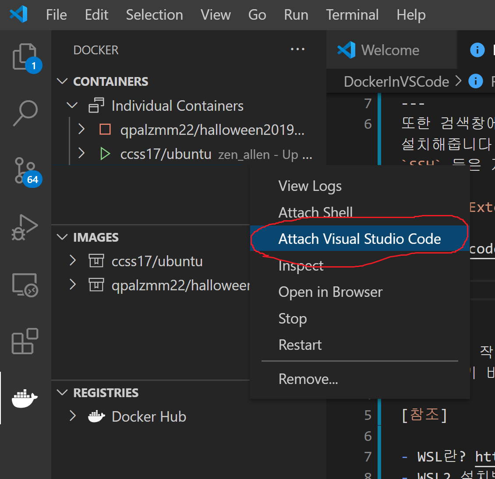

# VSCode 에서 Docker containers 이용하기

저는 Windows를 사용하기 때문에 우리가 배우는 Linux 명령어들을 어떻게 하면 사용할 수 있을까 고민할 수 밖에 없었습니다. 

```
Container에 있는 Ubuntu Server를 언제까지나 쓸 수 있지도 않을거니와 Container로 생성된 ubuntu 에서 VSCode를 사용 못 하니까 내가 1주차에 배운 것들이 연결이 안된듯 한 느낌이 들었습니다.
```

그래서 `VSCode에서 Container안의 Ubuntu 파일들이 접근이 가능하면 좋겠다` 라는 생각이 들었습니다. 그래서 이를 가능케 하는 것이 저의 크리스마스 목표였습니다.

이를 위해서는 다음과 같은 Step들이 필요합니다.

1. __WSL을 설치해야합니다.__ 
2. __VSCode에서 Docker Extention들을 설치해야합니다.__

---
## 1. WSL 설치

`WSL`은 `Window Subsystem for Linux`의 줄임말로 간단하게 설명하자면 Windows에서 Linux 유틸, CLI, 파일 등을 실행가능케 하는 시스템입니다. 또한 역으로, Bash Shell 에서 Windows 파일을 사용가능합니다.  

이것을 공부할 때 다음이 가능하다면 정말 좋겠다는 생각이사용해야 하는 이유는 너무나도 많습니다. 다음은 그 중 내가 생각하는 가장 큰 2가지 이유입니다.

1. Windows사용 유저로써 `apt-get`이라는 명령어는 너무나도 사기적입니다. 그것 하나만으로도 이미 충분한 이유가 될 거라 생각합니다.

2. `Powershell` 이라는 Tool이 `Bash Shell`을 사용가능케 하지만 UI가 너무 구려 쓰기가 싫었습니다. ~~WSL 사용하기전엔 Git Bash를 사용한건 비밀...~~


`WSL`를 설치한다면 본인 로컬 컴퓨터에서 다른 OS`(ubuntu, Kali linux, SUSE 등등...)`를 `Docker`에서 `Container` 쓰듯이 사용이 가능합니다! 물론 `Container` 에서도 사용이 가능하지만 이제는 가상의 데스크탑이 아닌 본인의 `Local repositories`들도 접근이 가능해집니다. ~~wow!~~

    `SL2는 나온지 얼마 안되기도 하였고 사용자가 주의를 하지않으면 보안 문제가 쉽게 생길 수 있어보입니다. 특히 WSL로 사용하는 OS에서 security hole이 생기면 큰 보안 문제가 생길수도 있지 않을까 싶습니다. (이것은 지극히 저의 모자란 지식으로 예상하는 겁니다. 이를 증명하는 증거와 정보는 일절 없습니다)

---

WSL는 밑의 [링크](https://docs.microsoft.com/ko-kr/windows/wsl/install-win10)를 보고 Document를 보고 설치할 수 있습니다... 만 기왕 하는 거 제가 설명하도록 하겠습니다.


영어로 되어있어 꽤나 복잡해보이지만 생각보다 간단합니다... 

1. `powershell`을 관리자 권한으로 실행합니다. 
2. 다음 명령어를 입력합니다. 정확히 뭔지는 모르겠지만 `WSL 1`을 사용가능하게 하는 명령어 입니다.
    ```powershell
    dism.exe /online /enable-feature /featurename:Microsoft-Windows-Subsystem-Linux /all /norestart
    ```
3. 다음 명령어를 입력합니다. 정확히 뭔지는 모르겠지만 `WSL 2`을 사용가능하게 하는 명령어입니다. 이제 컴퓨터를 재시작합니다.
    ```powershell
    2: dism.exe /online /enable-feature /featurename:VirtualMachinePlatform /all /norestart
    ```
4. 다음은 [링크](https://docs.microsoft.com/ko-kr/windows/wsl/install-win10#step-4---download-the-linux-kernel-update-package)에 들어가 `kernel-update-package`를 다운받습니다.
뭔가 이름이 멋진 링크를 눌러 다운로드를 진행시켜주면 됩니다. 

5. Default setting 으로 `WSL2`로 지정합니다. 
 ```powershell
    awsl --set-default-version 2
   ```
6. 이제 준비가 다 되었습니다.  `Microsoft store`에서 원하는 OS를 다운로드받아 실행시키면 사용이 가능합니다. 저는 `ubuntu`를 사용하였습니다.
---

<i> 참고로 `WSL`에서 실행시킨 OS에서 Local files들은 `/mnt` 안에 있습니다. 사진에서의 `/c` 는 드라이브의 이름입니다.</i>


## 2. VSCode에서 Docker 설치하기 

WSL2를 정상적으로 다운로드 했다면 이제는 VSCode에서 `docker`를 검색해 `Docker` 와 `Docker Explorer` 를 install 해줍니다.


---
또한 검색창에 `remote`를 검색해 `Remote Developement`를 설치해줍니다. 이를 설치하면 위의 4개의 `WSL`, `Containers`, `SSH` 등은 자동으로 설치가 됩니다. 


---
설치를 마치면 다음과 같이 밑에 고래 아이콘이 하나 생깁니다. 이것을 누르면 아래의 그림이 나옵니다.



우리가 원하는 것은 Container로 생성된 ubuntu를 VSCode로 사용하는 것이니 <span style="color:red"> 빨간색</span>으로 표시된 새로운 창을 pop up하는 버튼을 누르면 새로운 창이 뜬다.


보이다싶히 Container의 Ubuntu가 사용되고 있는 것을 확인 할 수 있었다.
그러면 이제 VSCode를 사용하여 Container안의 내용물을 수정할 수 있는 환경을 만들었다.

*** 

도저히 이 작자가 무슨 말을 하는지 모르겠다 싶으면 다음을 참조하시기 바랍니다.

### [참조]

- WSL란? 
    - https://docs.microsoft.com/ko-kr/windows/wsl/about
- WSL2 설치방법 
    - https://www.44bits.io/ko/post/wsl2-install-and-basic-usage
    - https://melonicedlatte.com/2020/07/05/200400.html
- VSCode에서 Docker 사용하기 
    - https://code.visualstudio.com/docs/remote/wsl-tutorial
